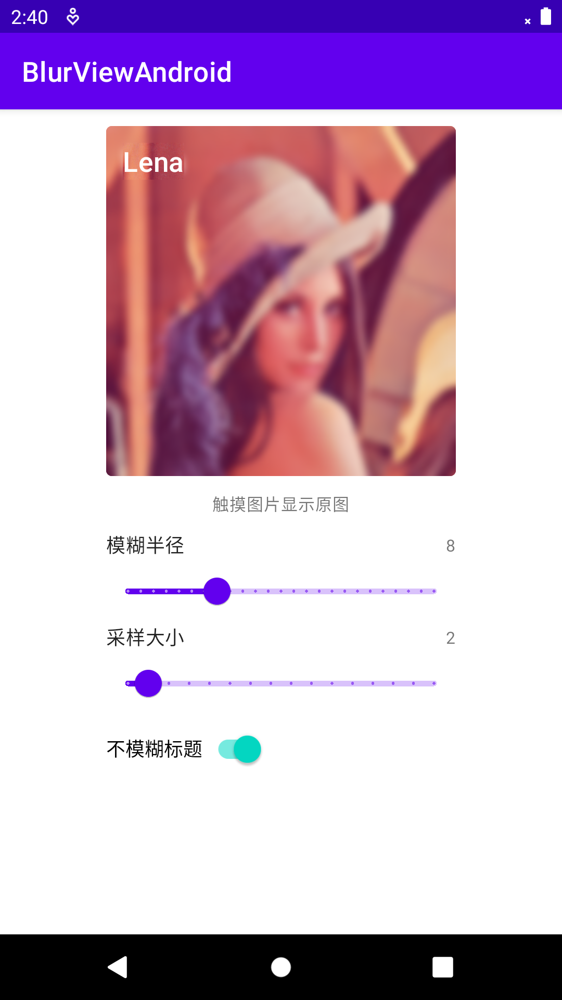

# BlurViewAndroid

BlurView for Android.

- `BlurView`接口

    - `public void setBlurRadius(float blurRadius)`

      设置模糊半径（`0 < blurRadius <= 25`），默认模糊半径为`16`

    - `public float getBlurRadius()`

      获取模糊半径

    - `public void setInSampleSize(int inSampleSize)`

      设置采样大小（`inSampleSize > 0`），默认采样大小为`4`，采样大小越大，图片越不清晰

    - `public int getInSampleSize()`

      获取采样大小

    - `public void setViewExcludes(@Nullable Collection<View> viewExcludes)`

      设置不模糊视图，集合中的视图将不会被模糊

    - `public Collection<View> getViewExcludes()`

      获取不模糊视图

- 示例
  

- 参考

    - [How to Create a Dynamic Blur Effect on Android](https://medium.com/@Intersog/how-to-create-a-dynamic-blur-effect-on-android-b835d514684)
